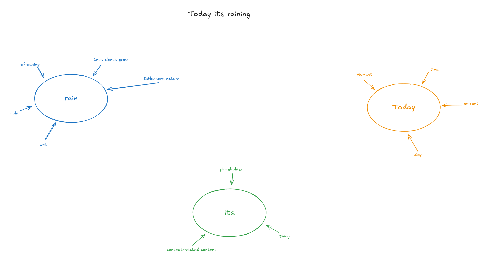
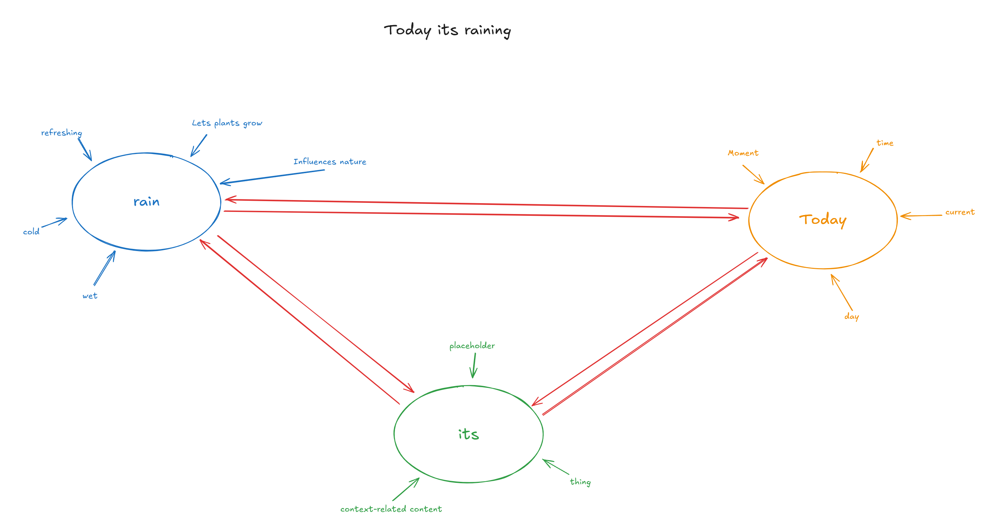
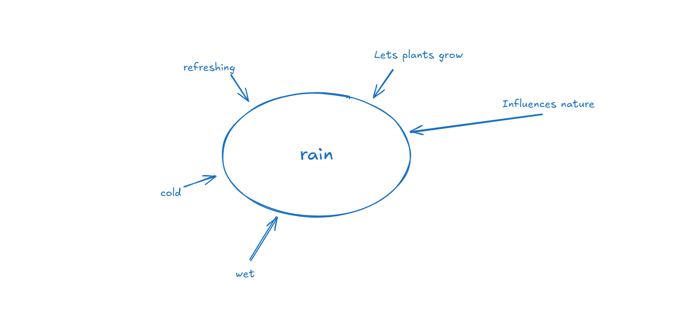

# How to make a computer curious

Curiousity is a very important key factor to motivate a computer into anything, and luckily it seems pretty easy too! Lets take the example below where a text input prompt would result in `Today its raining`. We could split it based on spaces or only supply one word per prompt, doesnt really matter.

This would result in an array of `today`, `its` and `raining`. We could check for each item in the array if a concept is known or not. If not, a new mindmap/circle is created. In the example below we already have these three concepts.

As you can see each concept, like `rain` has properties, like `wet`, `cold`, etc.. Lets keep it like that for now!

------

## Creating Bonds

As with our brain, its important to detect recurring patterns. We can see in our example sentence that these three words come together, so we increase a count for  that. If you have a sentence like `Today it is raining again`, we have `Today`, `rain` and `its` again, so we increase that counter again. Based on that counter we could form connections that'll grow stronger over time

------

## Creating complex concepts

In theory learning complex concepts is super easy too! Lets say we have a few more mindmaps, like `sunny` and `foggy`. Now imagine you'd create a new layer on top of it that has new mindmaps based on the one from the picture above. It would have mindmaps like `weather`, and its properties could include `sunny`, `foggy`, `rainy`.

If you get what im trying to say is that these "complex concepts" are just normal concepts build upon others! So the concept `weather` is just other concepts combined, like `rainy`, `sunny`, `foggy`, etc... 

Thats not all tho! We now have the concept of `weather`, imagine we have concept of `regions` or `locations`, now if you were to combine `weather` and `locations`, you could make a new layer and a mindmap like `climate`, consisting of concepts like `weather` and `locations`!

This means that everything is simply built upon each other! In theory you dont need any layers, but i think it helps to understand it better, at least it did for me

------

## How the computer becomes curious

Every concept has properties that we need to teach somehow, and as in this example, the concept `rain` has properties like `wet`, `cold`, etc... The problem is if you look at the entire map you'll realise that it only knows about the concepts `rain`, `today` and `its`, but not about `wet`, `cold` or others.

Thats where a simple rule becomes a game changer. If you tell your computer to search for all properties where there is no concept yet, try to solve it! Try to find out what it is, maybe by asking the user about it via a prompt or similar.

When you try to teach about the concepts of `wet`, like `saturated with liquid`, new concepts emerge, like `saturation`, `with`, `liquid`. Now it has new concepts again that are unkown to the computer, so the circle repeats and repeats.

An AI thats not curious is not going to learn or wont have any motivation or goals.

------

## Final words

These are concepts im trying to solve or think about as im very interested in creating my own, real, and actual artificial intelligence, as i dont believe in LLMs, as they are too static and in my opinion fundamentally flawed to become a real intelligence, even if they could self update etc. 

While i didnt try these ideas in code yet, the concept stays the same, and i think about it a lot from a coding perspective too, and its 100% doable and shouldnt be too hard to achieve.

I think in this case the trickiest part will be creating connections between concepts.