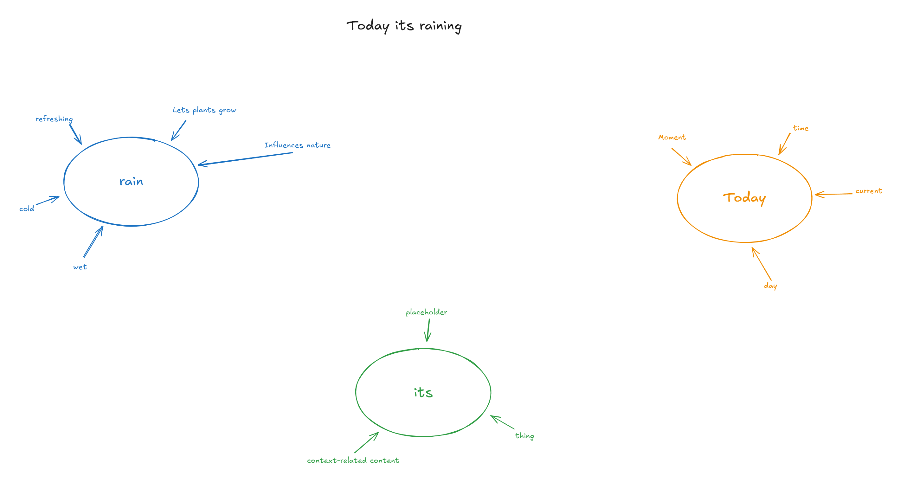
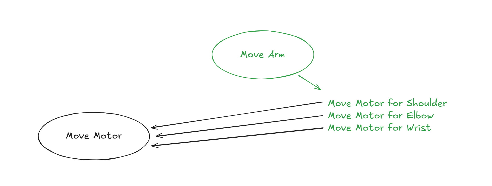

# Knowledge and Actions

Knowledge and Actions are two very similar concepts and only differ in their purpose. Knowledge is basically used to learn new concepts, link concepts with each other and create even more complex concepts. Its basically where all the information is stored, like a lexicon, and actions use that information to perform actions.

------

## Knowledge

Knowledge is basically a collection of concepts and their properties. These properties (like `wet`) are concepts themselves (like `rain`). Basically a collection of information, like shown below as mindmaps. Basically this is the part that makes an AI learn and create concepts.

------

## Actions

Actions on the other hand will describe how an action is performed. Basically its the same as knowledge, with the difference that actions are built upon each other. If you want to move an arm, you'll need to move the motor. 

In the example below we know the action `Move Motor` and `Move Arm`. In order to move your entire arm forward, you'll need to move your shoulder, elbow and wrist. So basically, the `Move Arm` action consists of three `Move Motor` actions. 

Its basically the same for knowledge, but instead of learning, its about how to do something. For your AI to know what it even means to move a shoulder etc its important that the Knowledge and Actions go hand-in-hand together. They cannot function on their own alone, because knowledge without actions would be useless, and actions wouldnt know what its supposed to do.

If you think about it, its like a huge database of known basic functions and function sequences to achieve a specific result or to perform an action.

